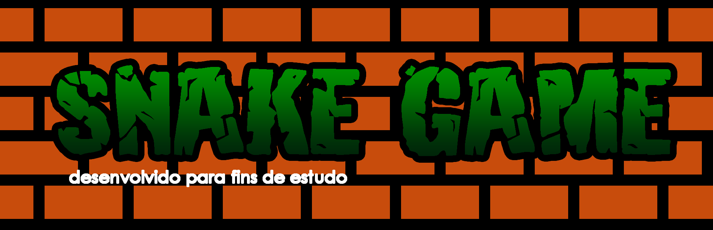
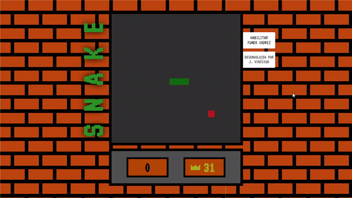

# Descrição

Jogo da cobrinha construído inteiramente em JavaScript puro e HTML Canvas.

# Demonstração

    

# Status do projeto

Concluído, porém novas implementações podem ser realizadas futuramente.

# Checklist

- [x] Movimentação do jogador
- [x] Incremento à cauda
- [x] Estilização da página
- [x] Correção de bugs

# Tecnologias

As seguintes ferramentas foram usadas na construção do projeto:

- [JavaScript](https://www.javascript.com/)
- [HTML](https://developer.mozilla.org/pt-BR/docs/Web/HTML)
- [CSS](https://www.w3.org/Style/CSS/Overview.en.html)

# Licença

- MIT